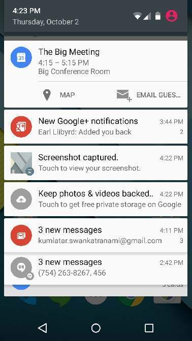

## 알림기능 살펴보기

### 1. 토스트

토스트는 간단한 메시지를 잠깐 보여주었다가 없어지는 뷰로 애플리케이션 위에 떠 있는 뷰라고 할 수 있다. 이것은 대화상자와 함께 사용자에게 필요한 정보를 알려주는 역할을 하는 대표적인 위젯으로 <u>포커스를 받지 않으므로</u> 대화상자보다 더 일반적으로 사용할 수 있으며 디버깅 등의 목적으로도 사용될수 있습니다. 특히, <u>애플리케이션이 화면에서 사라지더라도 필요한 메시지가 그대로 표시</u>되므로 애플리케이션의 상태와 관계없이 보여줄 수 있다는 장점이 있습니다.

예를 들어, 액티비티 상태메소드 중에서 onDestroy() 메소드 안에서 보여주는 토스트 메시지는 애플리케이션의 액티비티가 화면에서 사라진 다음에도 화면에 그대로 남아있는 것을 알 수 있습니다.

* 토스트의 코드
	
	Toast.makeText(Context context, String message, int duration)

Context 객체는 일반적으로 Context클래스를 상속한 액티비티를 사용하게 된다. 보여주고 싶은 메시지와 디스플레이 시간을 파라미터로 전달하여 객체를 생성한 후 show() 메소드를 호출하면 토스트가 화면에 보이게 된다. 

토스트는 다음의 기능을 사용하면 그 위치나 모양을 바꿀 수 있다.

* public void setGravity(int gravity, int xOffset, int yOffset) 
	- 토스트 뷰가 보이는 화면상의 위치를 지정
* publi void setMargin(float horizontalMargin, float verticalMargin)
	- 외부 여백을 지정한다. 이것을 통해 토스트를 중앙이나 우측하단에 배치할 수 있다.
* 토스트 메시지는 toast.xml 을 통해 Shape 정의 파일을 만들어 토스트에 이미지 또는 색상 크기등을 지정할 수 있다.

---
### 2. 스낵바

스낵바를 사용하려면 Support:design Library를 추가해주어야 한다. 필자는 compile 'com.android.support:design:26.+' 컴파일버전 26에 맞추어 라이브러리를 추가하였다.

스낵바는 토스트와 비슷하게 사용하는데 뷰에서는 Context가 들어갔다면 스낵바는 View가 파라미터를 사용된다.

	Snackbar.makeText(View view, String message, int duration)

* MainActivity.java

	     Snackbar bar = Snackbar.make(getWindow().getDecorView().getRootView(),
		 "스낵바테스트입니다.",Snackbar.LENGTH_INDEFINITE);
         bar.setActionTextColor(Color.parseColor("#FF0000"));    // 스낵바 선택 색 빨강으로 변경
         bar.show(); 

* 스낵바에 버튼 달기

		 Snackbar.make(v, "ITPANGPANG", 10000).setAction("YES", new View.OnClickListener() 
        {
            @Override
            public void onClick(View v) 
            {
                //할거
            }
        }).show();

* 주요 기능
	*  setActionTextColor() : 스낵바의 버튼 색상 변경
	*  View barView = snackbar.getView(); barView.setBackgroundColor(Color.parseColor("#ff0000"));    
		* 스낵바 배경색 빨강으로 변경

---
### 3. 대화상자

대화상자는 토스트보다 조금더 복잡한 내용을 표시할 때 사용한다.
알람의 선택사항 등과 같은 내용들을 표시하는데 사용한다.

Dialog로 생성하는 방법과 AlertDialog로 생성하는 방법이 있는데 Dialog 방법은 복잡하고 오래되어 잘 사용하지 않고 AlertDialog를 많이 사용한다.

AlertDialog를 사용할 때, 생성자가 protected로 가려져 있기 때문에 자체를 생성할 수는 없고 내부클래스 Builder를 이용하여 생성할 수 있다. 

Builder는 일단 생성해 놓고 메서드를 순서에 상관없이 호출하여 사용할 수 있다.

* 주요기능
	
	* AlertDialog.Builder(Context context)
		* 인수로 컨텍스트를 전달하는데, 보통은 대화상자를 생성하는 "부모 액티비티"를 지정한다. 빌더 객체 생성 후에는 빌더의 메서드(method)를 통해 대화상자의 다양한 설정을 초기화한다.
	* AlertDialog.Builder setMessage (CharSequence message)    // 대화상자의 메시지
	* AlertDialog.Builder setTitle (CharSequence title)                // 타이틀 바의 문자열
	* AlertDialog.Builder setIcon (int iconId)                            // 아이콘 지정
	* AlertDialog show () //다이얼로그를 보여준다
	* AlertDialog create () //다이얼로그를 생성한다.
	
	각 메서드는 여러 가지 형태로 오버로딩 되어 있다.	
	메시지와 타이틀은 문자열 상수 외에도 문자열 리소스ID (string.리소스ID)도 받을 수 있으며
	setIcon 메서드는 리소스 ID외에 드로블(Drawable)도 지정할 수 있다.
	
	
	모든 "설정 메서드"는 빌더 자신을 다시 리턴함으로써 연쇄적인 호출을 허용한다.
	다음 두 메서드는 대화상자를 보이고 생성한다.
	

* 대화상자의 버튼

	대화상자에는 최대 3개까지의 버튼을 표시할 수 있다.
	
	* setPositiveButton (CharSequence text, DialogInterface.OnClickListener listener)   // 긍정
	* setNeutralButton (CharSequence text, DialogInterface.OnClickListener listener)   // 중립
	* setNegativeButton(CharSequence text, DialogInterface.OnClickListener listener)  // 부정
	
	첫번째 인수 : 버튼에 표시할 텍스트, 
	두번째 인수 : 클릭리스너

	* 예제 코드

			new AlertDialog.Builder(this)
			.setTitle("질문")
			.setMessage("나는 잘생겼다면 YES, 아니면 NO")
			.setIcon(R.drawable.androboy)
			.setPositiveButton("YES", null)
			.setNegativeButton("NO", null)
			.show();

* 대화상자 닫기 방법

	* 핸드폰의 Back 터치로 대화상자를 닫을 수 없게 하려면
	 	* AlertDialog.Builder setCancelable (boolean cancelable) 호출,
			보통 중요한 메시지를 전달할 때 위 방법을 쓴다.

		* 방법: .setCancelable (false) 호출문을 추가
	* 대화상자 바깥은 눌러서 닫기
		* void Dialog.setCanceledOnTouchOutside (boolean cancel) 호출, 빌더로부터 직접 호출이 안되고, AlertDialog 객체를 생성후 호출한다.

	* 예제 코드

			AlertDialog dialog = new AlertDialog.Builder(this) // AlertDialog 객체 생성후 호출
			.setTitle("알림")
			.setMessage("대화상자 바깥을 누르면 닫힙니다.")
			.setIcon(R.drawable.androboy)
			.setNegativeButton("닫기", null)
			.create();
			
			dialog.setCanceledOnTouchOutside(true);		// 바깥을 눌러서 닫기
			dialog.show();

*  대화상자 미리 생성

대화상자는 많은 속성을 지정하기 떄문에, 다량의 메모리를 사용한다.
그래서 매번 생성하지 않고 대화상자를 미리 만들어 놓고 필요할 떄 보이도록 할 수 있는 메서드가 있다.
	
	void showDialog (int id)        // 대화상자 보이기
	void dismissDialog (int id)     // 대화상자 숨기기
	void removeDialog (int id)     // 대화상자 파괴하기

최초 호출 시 대화상자를 생성하여 화면에 출력하며 두 번째 이후부터는 미리 생성해 놓은 대화상자를
사용하여 반응속도를 높인다. 이 메서드를 사용하려는 액티비티는 대화상자를 관리하는 콜백 메서드를
반드시 재정의 해야 한다.

	Dialog onCreateDialog (int id)
	// onCreateDialog 메서드는 전달된 ID에 대응하는 대화상자를 생성하여 리턴한다.
	void onPrepareDialog (int id, Dialog dialog)
	// onPrepareDialog 메서드는 대화상자가 화면에 나타나기 전에 호출된다.
	   응용프로그램의 상태에 따라 대화상자를 갱신한다.

* 목록 대화상자

아래의 메소드를 사용하여 목록형으로 대화상자를 구현할 수 있다.

		AlertDialog.Builder setItems (CharSequence[] items, DialogInterface.OnClickListener listener)	
		AlertDialog.Builder setItems (int itemsId, DialogInterface.OnClickListener listener)

* 대화상자 사용 주의사항
	* 대화상자는 non-blocking modal이므로 실행 후 자동으로 다음 코드를 진행한다.
	 

---
### 4. 통지(Notification)

통지란 어플리케이션이나 기타 작업 도중에 사용자가 알기 쉽도록 메시지를 보내는 것이다. 백그라운드 프로세스가 사용자와 확실하게 소토할 수 있는 방법이다. 통지는 표시뿐아니라 소리, 진동, 불빛 등 여러가지 방법으로 제공될 수 있다.

**알림영역의 알림 아이콘**

**알림창의 알림**

**알림 생성**
기존의 Notification 객체에서 NotificationCompat을 사용하도록 바뀜.
NotificationCompat.Builder 개체에서 알림에 대한 UI 정보와 작업을 지정합니다. 알림 자체를 생성하려면 NotificationCompat.Builder.build()를 호출합니다. 이는 사양이 포함된 Notification 객체를 반환합니다. 알림을 발행하려면 NotificationManager.notify()를 호출해서 시스템에 Notification 객체를 전달합니다.

필수 알림 콘텐츠 - Notification 객체는 다음을 반드시 포함해야 합니다.
	
	setSmallIcon()이 설정한 작은 아이콘
	setContentTitle()이 설정한 제목
	setContentText()이 설정한 세부 텍스트

**소스 코드**

		// 통지 목록에 들어갈 큰 아이콘 비트맵으로 선언.
		Bitmap mLargeIconForNoti =
                        BitmapFactory.decodeResource(getResources(), R.drawable.notification_icon);

		// 해당 통지에 관한 액티비티로 이동하기 위해 PendingIntent 구현
	   PendingIntent mPendingIntent = PendingIntent.getActivity(MainActivity.this,
                        0,
                        new Intent(getApplicationContext(), MainActivity.class),
                        PendingIntent.FLAG_UPDATE_CURRENT
                );

                NotificationCompat.Builder mBuilder = new NotificationCompat.Builder(MainActivity.this)
                        .setSmallIcon(R.drawable.notification_icon)
                        .setContentTitle("통지 제목")
                        .setContentText("통지 내용~~~")
                        .setDefaults(Notification.DEFAULT_LIGHTS)	//통지 표시방식(빛)
                        .setLargeIcon(mLargeIconForNoti)	// 통지 큰 아이콘 통지목록에서
                        .setPriority(NotificationCompat.PRIORITY_DEFAULT)	//통지의 중요도
                        .setAutoCancel(true)	// 통지 클릭시 자동없어짐 선택
                        .setContentIntent(mPendingIntent);

				// 시스템의 NotificationManager를 가져와서 notifiy메소드를 사용하여 노티를 보냄.
                NotificationManager mNotificationManager =
                        (NotificationManager) getSystemService(NOTIFICATION_SERVICE);

                mNotificationManager.notify(0, mBuilder.build());
	

**기능**

1. setLargeIcon : 큰그림
2. setSmallIcon : 큰그림 밑에 작은그림
3. setTicker : 알람 발생시 잠깐 나오는 텍스트 (테스트 해보니까 가상 머신에서는 안나오고 실제 디바이스에서는 나오네요)
4. setContetnTitle : 제목
5. setContentText : 내용
6. setWen : 알람 시간 (miliSecond 단위로 넣어주면 내부적으로 자동으로 파싱합니다)
7. setDefaults : 알람발생시 진동, 사운드등을 설정 (사운드, 진동 둘다 설정할수도 있고 한개 또는 설정하지 않을 수도있음)
8. setContentIntent : 알람을 눌렀을 때 실행할작업 인텐트를 설정합니다.
9. setAutoCancel : 알람 터치시 자동으로 삭제할 것인지 설정합니다.
10. setNumber : 확인하지 않은 알림 갯수를 설정합니다. (999가 초과되면 999+로 나타냅니다.)